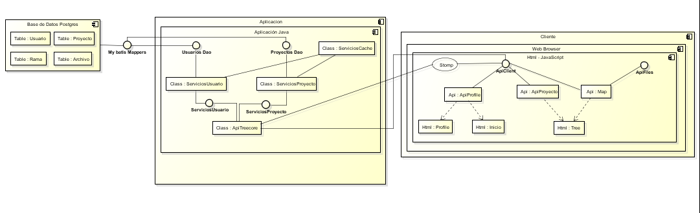
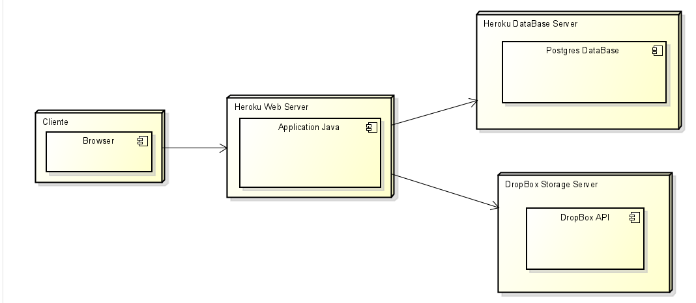
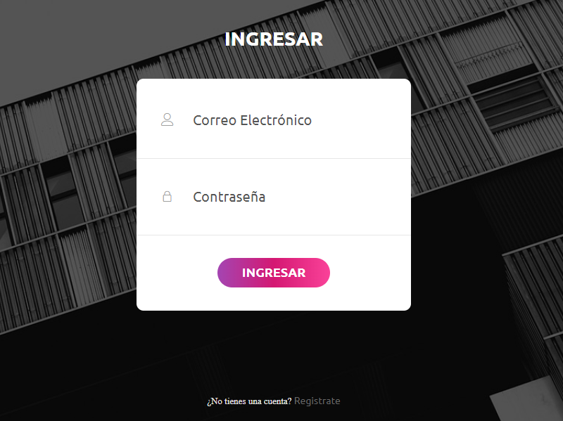

# Nombre: 
TreeCore 
# Integrantes:
Natalia Durán Vivas

Julián David Gutiérrez Vanegas

Andrés Ricardo Martínez Díaz

# Resumen
El proyecto se basará en crear una aplicación que consiste en una herramienta interactiva con la cual se podrán gestionar proyectos en tiempo real por múltiples usuarios al mismo tiempo. Esta herramienta utilizará una interfaz en forma de "árbol" donde en su centro se encontrará el nombre del proyecto en curso (rama central) y de él se irán desprendiendo múltiples ramas, que a su vez tendrán las opciones de agregar una nueva rama “hija” o de ser eliminada. Cada rama representa los componentes que forman a un proyecto y estas a su vez, dependiendo del tipo, tienen la oportunidad de convertirse en un subproyecto dependiendo de las necesidades de los usuarios.

Los proyectos podrán ser creados por cualquier usuario de la aplicación y este, a su vez, podrá invitar a otros usuarios de la aplicación para que sean colaboradores en su proyecto, dándoles así la oportunidad de modificar los componentes que se encuentran en el mismo.

# Descripción

La aplicación contará con tres pantallas principales: autenticación del usuario, perfil de un usuario y visualización de un proyecto. 

A continuación, se darán más detalles sobre cada una de las distintas pantallas: 

•	Autenticación: 

Esta pantalla consistirá en un cuadro de dialogo central que le solicitará al usuario el correo y la contraseña con los cuales se autentica en la plataforma:


A su vez, debajo de este cuadro de dialogo existirá una opción denominada “Registrarse”. Cuando el usuario oprima sobre esta opción, se desplegará un panel en el que se solicitarán al usuario distintos datos básicos, tales como: nombre, correo y contraseña para la aplicación.


Una vez el usuario se ha registrado, volverá al proceso de autenticación y digitando los datos correspondientes ya podrá hacer uso de la aplicación

•	Perfil del usuario: 
Una vez el usuario se ha autenticado correctamente, ingresará en su perfil, donde podrá ver: proyectos activos, notificaciones, invitaciones a participar en proyectos, información sobre su cuenta y crear un nuevo proyecto:


•	Visualización de un proyecto:
Cuando un usuario acceda a un proyecto al cual hace parte, tendrá la siguiente pantalla:


En esta pantalla se podrá consultar la estructura del proyecto, tener un chat con los participantes del proyecto y una opción en la parte superior derecha que permite agregar un nuevo usuario al proyecto.
Cuando el usuario oprima el icono de archivos de una rama del árbol, se desplegará en pantalla un panel que le permitirá ver los aportes que se han realizado sobre esta tarea, esto incluye: Una pequeña descripción y los archivos. Además, tendrá las opciones de eliminar rama o adjuntar una rama hija a ella:


Al dar clic en la rama se redirigiría a un enlace con la información colocada en el espacio de ella:


# Historias de usuario
1.
COMO miembro de equipo de un proyecto
QUIERO poder acceder al contenido de un proyecto
PARA poder ver, agregar, modificar o eliminar los archivos, ramas y contenido.

Criterios de aceptación:

- Ver la completa estructura del proyecto como árbol.
- Tener la opción de ver las ramas por separado
- Poder agregar ramas y contenido.
- Poder eliminar ramas y contenido.
- Poder modificar ramas y contenido.
- Ser capaz de subir archivos a las ramas.


# Arquitectura

A continuación presentamos el diagrama de clases de la estructura que tenemos pensada para el proyecto

## Diagrama de clases


## Modelo Entidad-Relación


## Diagrama de componentes



## Diagrama de despliegue



# Heroku

```markdown
https://treecore.herokuapp.com/
```

# Planeación en Taiga

```markdown
https://tree.taiga.io/project/nduran06-treecoreproject/
```

# CircleCI

[](https://app.circleci.com/pipelines/github/JulianGutierritos/ProyectoARSW)

# Codacy 
[](https://app.codacy.com/manual/JulianGutierritos/ProyectoARSW/dashboard?utm_source=github.com&amp;utm_medium=referral&amp;utm_content=ricar8o/Lab-6&amp;utm_campaign=Badge_Grade)

# Documentación API

```markdown
https://app.swaggerhub.com/apis-docs/Ricar8o/tree-core_api/1.0.0
```

# Rendimiento 

Le dimos una gran importancia a la velocidad de carga de nuestra aplicación. Es por eso que nos pusimos como meta que, en la medida de lo posible, la aplicación tuviera la menor interacción con la base de datos, ya que esto toma demasiado tiempo. Es por esto que implementamos un caché dinámico que se actualiza a la par de la base de datos y que contiene tanto la información completa de los usuarios, como la de los proyectos de los mismos. 

Para demostrar el funcionamiento de nuestro caché, presentamos el siguiente vídeo. En este mostraremos que cuando un usuario ingresa a nuestra aplicación, la base de datos es consultada una única vez en todo lo que dure la sesión del usuario (también puede ser que no sea consultada ninguna vez si el usuario ha ingresado a la aplicación recientemente). En el vídeo se harán una serie de "deletes" directamente en la base de datos, haciendo con esto que al ser ejecutados directamente en la base de datos, el caché no cambie por ellos, y que por lo tanto, los deletes no se vean reflejados en la aplicación. 
(Cabe recalcar que esto sucede porque las eliminiciones o modificaciones de datos sobre la base de datos nunca pueden hacerse directamente. Es decir, en el transcurso normal de la aplicación, la información contenida en el caché siempre estará sincronizada con la información que se encuentra en la base de datos)

```markdown
https://drive.google.com/file/d/1yV2IitSxzlneK5O3jAcLbT2puQcny3En/view
```
Y ya que vimos como nuestro caché hace que las consultas sobre la base de datos no se hagan constantemente en el transcurso de nuestra aplicación, ahora mostraremos el porqué de nuestra decisión. 
A continuación presentamos los resultados de una serie de gets realizados sobre nuestra aplicación:


Como se puede observar claramente el primer get realizado se demoró muchisimo más en comparación a los gets siguientes. Esto se debe a que la información de la primera consulta fue traida desde la base de datos y almacenada en el caché, mientras que la información de los gets siguientes es traída del caché. Esto nos demuestra como nuestro caché vuelve a la aplicación más rápida, garantizando así un mejor desempeño.

También cabe recalcar que este caché no solo hace nuestra aplicación más rápida, sino que la hará disponible en caso de que la base de datos se caiga. Y aunque por razones de integridad de la información, sin base de datos el usuario no podrá ingresar nueva información, sí podrá consultar la información que haya sido ingresada antes de que la base de datos estuviera caida. Así que el usuario podrá: leer los mensajes de todos sus proyectos y ver la información de todas las ramas de sus proyectos, incluyendo descargar archivos que se encuentren ya dentro de ellas. 

# Usabilidad 

Nuestro proyecto fue diseñado teniendo como premisa ser fácil e intuitivo de usar, enfocandonos bastante en la experiencia de usuario. 
A continuación algunas de las heuristicas del diseño que nuestro proyecto cumple:

## Visibilidad del estado del sistema 

Esta es la heuristica que tal vez se nota con mayor facilidad y esto se debe principalmente a que: 

- Nuestro proyecto cuenta con notificaciones que le informan inmediatamente al usuario sobre cualquier cambio en cualquiera de sus proyectos de manera clara y al instante


- Nuestro proyecto muestra de manera clara al usuario cuando existe una nueva invitación para él.


- Nuestro proyecto informa al usuario de manera clara no solo los errores que pueden surigir, sino que también muestra los aciertos en ocasiones donde estos no se muestran inmediatamente en pantalla (como cuando se crea un proyecto o se invita a un usuario a participar de uno)


## Coincidencia entre el sistema y el mundo real

Todos los mensajes que se despliegan a lo largo de la aplicación están hechos para que puedan ser entendidos facilmente. Muestra de esto aquí tenemos un mensaje de error que informa al usuario de manera clara porque no puede agregar a este nuevo participante y a continuación veremos un mensaje de advertencia que de manera igualmente clara informa al usuario sobre lo que está apunto de hacer y las consecuencias de ello


## Consistencia y estandar

Como se podrá notar a lo largo del manual de usuario, las pantallas dentro de la aplicación tienen el mismo encabezado y los botones dentro de la aplicación formas similares. Además, como hemos visto acá arriba, los mensajes de: advertencia, error y acierto, son fácilmente distinguibles el uno de otro gracias a sus grandes iconos, haciendo que para el usuario sea muy díficil confundir un mensaje de acierto con uno de fallo.

## Prevención de errores

La aplicación cuenta con mensajes de advertencia claros en las acciones más importnates, y que a la vez, pueden llegar a ser irreversibles, como: salir de un proyecto, eliminar un proyecto y eliminar una rama de un proyecto.


## Diseño estético y minimalista

El diseño de nuestra aplicación está muy bien trabajado. Ninguna de nuestras pantallas está llena de cosas, sino que usamos estéticos "pop ups" que hagan que la pantalla no esté tan sobrecargada. También utilizamos una buena paleta de colores y adornamos algunos formularios con imagenes que estén relacionadas con estos. 


## Ayuda y documentacion

Contamos con un manual de usuario, que se presentará a continuación, además, nuestro código se encuentra bien documentado, en especial nuestros métodos: get, post, delete y put.

# Manual de usuario 

A continuación se presenta nuestra pantalla principal, en ella el usuario podrá: ver la información de nuestra aplicación, ir al formulario de registro o directamente al formulario de ingresar si ya posee una cuenta:


Si el usuario presiona el botón de registrarse, será redirigido al siguiente formulario donde tendrá que diligenciar algunos datos para poderse registrar en la aplicación. También, en la parte inferior del formulario, se le da la opción al usuario de ir al formulario de ingresar en caso de que ya posea una cuenta.


Ya sea llegando a través del formulario de registro o la pantalla principal, el usuario que ha dado en la opción de ingresar se encontrará con el siguiente formulario para ingresar a su sesión. En el tendrá que diligenciar su correo y contraseña para ingresar a la aplicación. También se presenta en la parte inferior del formulario de ingreso, una opción para que dirigirse al formulario de registro en caso de que el usuario no posea una cuenta.



Cuando el usuario ingrese a la aplicación, se encontrará con la siguiente pantalla: 


En la parte izquierda del encabezado, al lado del logo de la app, se encuentra un buzón con un número que indica el número de invitaciones a proyectos que el usuario tiene. Cuando el usuario oprima este buzón se le desplegarán todas las invitaciones que se le han hecho junto con las opciones de aceptarlas o rechazarlas. Si el usuario oprime "aceptar", inmediatamente después la invitación desparecerá y en su lista de proyectos (abajo del buzón) aparecerá este nuevo proyecto, porque el usuario ya formará parte este. Por el contrario, si oprime "rechazar" la invitación desaparecerá y ningún otra acción se realizará. 


En la parte derecha del encabezado se encuentra el botón de cerrar sesión. Si el usuario lo oprimer, su sesión se cerrará y será redirigido otra vez al formulario de ingreso. 

En la parte izquierda de la pantallaz aparece un botón de "Crear Nuevo Proyecto". Si el usuario lo oprime se redigirá a un formulario que veremos más adelante. Abajo de este, estan listados todos los proyectos a los cuales el usuario pertenece. En caso de que oprima click en alguno de ellos, será redirigido a la página del proyecto, la cual veremos más adelante.


En la parte derecha de la pantalla se listan las notificaciones del usuario. Aquí es donde el usuario puede ver los últimas modificaciones que se han hecho sobre los proyectos a los cuales pertence, así como también quién fue el que realizó estas modificaciones. 


Si el usuario oprime el botón "Crear Nuevo Proyecto" será redirigido al siguiente formulario. Allí el usuario podrá crear un nuevo proyecto dado un nombre y una descripción. Para esto, tendrá que llenar los dos espacios del formulario (obligatoriamente) y luego presionar "Guardar". En caso de que el usuario no desee crear un nuevo proyecto, podrá darle al botón cancelar y será redirigido otra vez a su perfil. (La pantalla también tiene el buzón de invitaciones anterior y la opción de cerrar sesión)


Si el usuario oprime sobre alguno de sus proyectos, será redirigido a la siguiente pantalla:


En el encabezado, además de las opciones ya descritas, se encuantra una de "Volver", la cual al ser oprimida lleva al usuario de nuevo a su perfil. 

En la parte superior izquierda, se encuentra un menú oculto que al ser oprimido se desplegará y aparecerán las siguientes opciones: "Agregar Colaborador" y "Abandonar Proyecto"


Si el usuario oprime la primera opción, se desplegará el siguiente formulario que le solicitará el correo de la persona que desea agregar como colaboradora al proyecto. Si el usuario digita el correo de manera correcta y oprime "AGREGAR", se mandará una invitación a esta persona para que sea participe del proyecto. La otra opción es "CERRAR", que lo único que hará es cerrar el formulario.


En la segunda opción del menú encontramos "ABANDONAR PROYECTO". Si el usuario da click sobre esta opción saldrá del proyecto, de vuelta a su perfil, y el proyecto ya no estará en su lista, ni recibirá notificaciones del mismo.

En la parte central de la pantalla nos encontramos con el árbol del proyecto. Este árbol está conformado por distintas ramas cada una con: nombre, archivos y descripción. 


Si el usuario oprime sobre cualquiera de las ramas apareceran dos botones: uno que dice "me" y otro "+"


Si el usuario da en el "me", se desplegará la información de la rama, además de varias opciones para modificarla. La más notoria, es el campo grande de texto donde el usuario podrá digitar lo que desee y sí le da en el pequeño botón de "cambiar" ubicado en la esquina derecha de este campo, lo escrito se guardará y podrá ser visto por cualquier otro que acceda a la rama. 


Abajo de este campo están listados los archivos de la rama. Cada uno de ellos cuenta con dos botones: uno de una flecha, que al ser oprimido desplegará un seleccionador de archivos que le permitirá al usuario cambiar ese archivo por uno suyo


El botón del lado, el que tiene forma de caneca de basura, sirve para eliminar ese archivo. 
La otra opción es si el usuario da click sobre el archivo. En ese caso, el archivo será descargado al pc del usuario. 

Abajo de la lista de archivos están tres botones: el de "ver", sirve para que el usuario recargue los archivos de la rama, el de "Adicionar archivos" desplegará un seleccionador de archivos para que el usuario elija el archivo que desea subir a la rama y, finalmente, esta el botón de "cargar" que sirve para subir los archivos seleccionados a la rama (pueden ser varios simultaneamente).

En la parte inferior derecha del pop up está el simbolo de una caneca de basura, está sirve para eliminar la rama junto con toda la información que hay en ella. 
Una peculiaridad de la app, es que si se trata de elminar la rama del medio (la que cuenta con el mismo nombre del proyecto), todo el proyecto será eliminado (esta información por supuesto es suministrada al usuario cada vez que intente borrar la rama principal).

Por otro lado, si el usuario oprime el botón más, se desplegará el siguiente formulario


Este formulario sirve para crear una nueva rama que saldrá desde la rama sobre la cual el más fue seleccionado. 

Finalmente, en la parte de abajo de la pantalla, está un chat del proyecto.


Allí el usuario podrá interectuar en tiempo real con los demás colaboradores sobre temas del proyecto.


