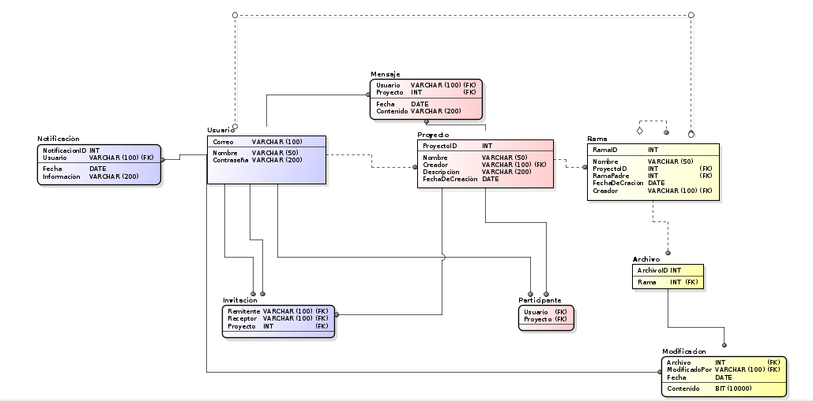

# Nombre: 
TreeCore 
# Integrantes:
Natalia Durán Vivas

Julián David Gutiérrez Vanegas

Andrés Ricardo Martínez Díaz

# Resumen
El proyecto se basará en crear una aplicación que consiste en una herramienta interactiva con la cual se podrán gestionar proyectos en tiempo real por múltiples usuarios al mismo tiempo. Esta herramienta utilizará una interfaz en forma de "árbol" donde en su centro se encontrará el nombre del proyecto en curso (rama central) y de él se irán desprendiendo múltiples ramas, que a su vez tendrán las opciones de agregar una nueva rama “hija” o de ser eliminada. Cada rama representa los componentes que forman a un proyecto y estas a su vez, dependiendo del tipo, tienen la oportunidad de convertirse en un subproyecto dependiendo de las necesidades de los usuarios.

Los proyectos podrán ser creados por cualquier usuario de la aplicación y este, a su vez, podrá invitar a otros usuarios de la aplicación para que sean colaboradores en su proyecto, dándoles así la oportunidad de modificar los componentes que se encuentran en el mismo.

# Descripción

La aplicación contará con tres pantallas principales: autenticación del usuario, perfil de un usuario y visualización de un proyecto. 

A continuación, se darán más detalles sobre cada una de las distintas pantallas: 

•	Autenticación: 

Esta pantalla consistirá en un cuadro de dialogo central que le solicitará al usuario el correo y la contraseña con los cuales se autentica en la plataforma:


A su vez, debajo de este cuadro de dialogo existirá una opción denominada “Registrarse”. Cuando el usuario oprima sobre esta opción, se desplegará un panel en el que se solicitarán al usuario distintos datos básicos, tales como: nombre, correo y contraseña para la aplicación.


Una vez el usuario se ha registrado, volverá al proceso de autenticación y digitando los datos correspondientes ya podrá hacer uso de la aplicación

•	Perfil del usuario: 
Una vez el usuario se ha autenticado correctamente, ingresará en su perfil, donde podrá ver: proyectos activos, notificaciones, invitaciones a participar en proyectos, información sobre su cuenta y crear un nuevo proyecto:


•	Visualización de un proyecto:
Cuando un usuario acceda a un proyecto al cual hace parte, tendrá la siguiente pantalla:


En esta pantalla se podrá consultar la estructura del proyecto, tener un chat con los participantes del proyecto y una opción en la parte superior derecha que permite agregar un nuevo usuario al proyecto.
Cuando el usuario oprima el icono de archivos de una rama del árbol, se desplegará en pantalla un panel que le permitirá ver los aportes que se han realizado sobre esta tarea, esto incluye: Una pequeña descripción y los archivos. Además, tendrá las opciones de eliminar rama o adjuntar una rama hija a ella:


Al dar clic en la rama se redirigiría a un enlace con la información colocada en el espacio de ella:


# Historias de usuario
1.
COMO miembro de equipo de un proyecto
QUIERO poder acceder al contenido de un proyecto
PARA poder ver, agregar, modificar o eliminar los archivos, ramas y contenido.

Criterios de aceptación:

- Ver la completa estructura del proyecto como árbol.
- Tener la opción de ver las ramas por separado
- Poder agregar ramas y contenido.
- Poder eliminar ramas y contenido.
- Poder modificar ramas y contenido.
- Ser capaz de subir archivos a las ramas.


# Arquitectura

A continuación presentamos el diagrama de clases de la estructura que tenemos pensada para el proyecto

## Diagrama de clases


## Modelo Entidad-Relación



## Diagrama de componentes


## Diagrama de despliegue


# Heroku

```markdown
https://treecore.herokuapp.com/
```

# Planeación en Taiga

```markdown
https://tree.taiga.io/project/nduran06-treecoreproject/
```

# CircleCI

[](https://app.circleci.com/pipelines/github/JulianGutierritos/ProyectoARSW)

# Codacy 
[](https://app.codacy.com/manual/JulianGutierritos/ProyectoARSW/dashboard?utm_source=github.com&amp;utm_medium=referral&amp;utm_content=ricar8o/Lab-6&amp;utm_campaign=Badge_Grade)

# Documentación API

```markdown
https://app.swaggerhub.com/apis-docs/Ricar8o/tree-core_api/1.0.0
```

# Rendimiento 

Le dimos una gran importancia a la velocidad de carga de nuestra aplicación. Es por eso que nos pusimos como meta que, en la medida de lo posible, la aplicación tuviera la menor interacción con la base de datos, ya que esto toma demasiado tiempo. Es por esto que implementamos un caché dinámico que se actualiza a la par de la base de datos y que contiene tanto la información completa de los usuarios, como la de los proyectos de los mismos. 

Para demostrar el funcionamiento de nuestro caché, presentamos el siguiente vídeo. En este mostraremos que cuando un usuario ingresa a nuestra aplicación, la base de datos es consultada una única vez en todo lo que dure la sesión del usuario (también puede ser que no sea consultada ninguna vez si el usuario ha ingresado a la aplicación recientemente). En el vídeo se harán una serie de "deletes" directamente en la base de datos, haciendo con esto que al ser ejecutados directamente en la base de datos, el caché no cambie por ellos, y que por lo tanto, los deletes no se vean reflejados en la aplicación. 
(Cabe recalcar que esto sucede porque las eliminiciones o modificaciones de datos sobre la base de datos nunca pueden hacerse directamente. Es decir, en el transcurso normal de la aplicación, la información contenida en el caché siempre estará sincronizada con la información que se encuentra en la base de datos)

```markdown
https://drive.google.com/file/d/1yV2IitSxzlneK5O3jAcLbT2puQcny3En/view
```
Y ya que vimos como nuestro caché hace que las consultas sobre la base de datos no se hagan constantemente en el transcurso de nuestra aplicación, ahora mostraremos el porqué de nuestra decisión. 
A continuación presentamos los resultados de una serie de gets realizados sobre nuestra aplicación:


Como se puede observar claramente el primer get realizado se demoró muchisimo más en comparación a los gets siguientes. Esto se debe a que la información de la primera consulta fue traida desde la base de datos y almacenada en el caché, mientras que la información de los gets siguientes es traída del caché. Esto nos demuestra como nuestro caché vuelve a la aplicación más rápida, garantizando así un mejor desempeño.

También cabe recalcar que este caché no solo hace nuestra aplicación más rápida, sino que la hará disponible en caso de que la base de datos se caiga. Y aunque por razones de integridad de la información, sin base de datos el usuario no podrá ingresar nueva información, sí podrá consultar la información que haya sido ingresada antes de que la base de datos estuviera caida. Así que el usuario podrá: leer los mensajes de todos sus proyectos y ver la información de todas las ramas de sus proyectos, incluyendo descargar archivos que se encuentren ya dentro de ellas. 


